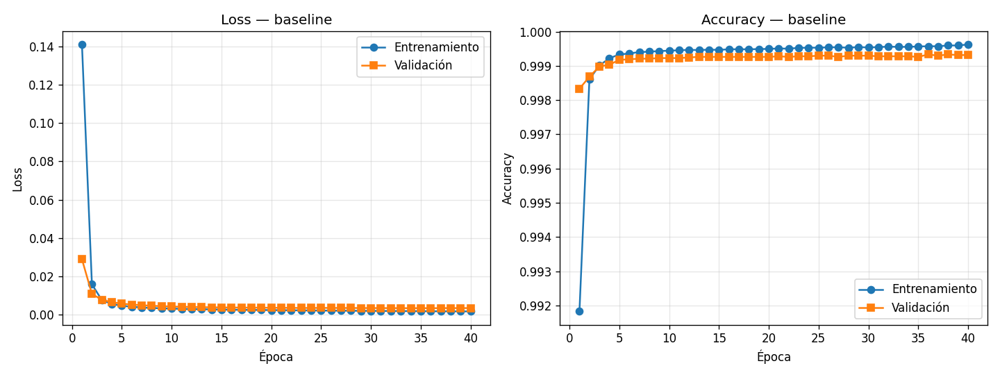
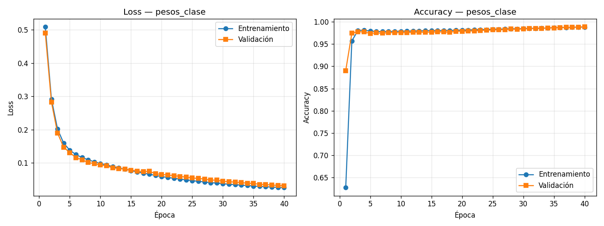
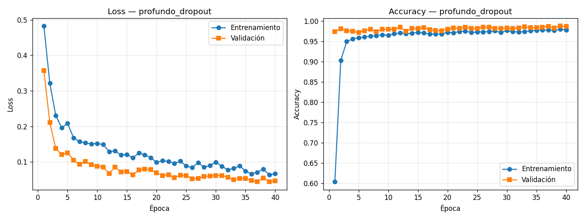
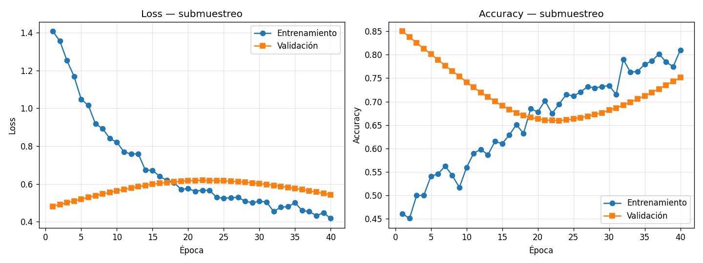
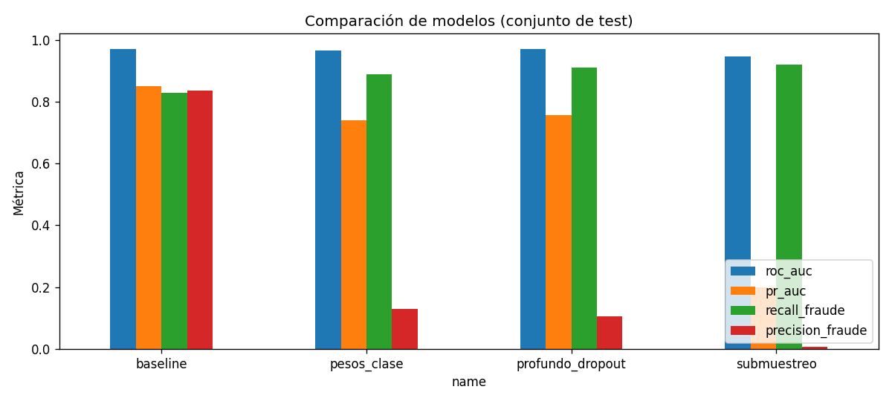

# Reporte — Detección de fraude en tarjetas de crédito con una Red Neuronal

**Tarea de Redes Neuronales Artificiales** · Dr. Jorge Velazquez-Castro
**Problema 2:** Detectar fraudes en movimientos de tarjetas bancarias
**Dataset:** [Credit Card Fraud Detection — mlg-ulb (Kaggle)](https://www.kaggle.com/datasets/mlg-ulb/creditcardfraud)

> Las imágenes de este reporte (`results/*.png`) y la tabla `results/resumen.csv` se generan
> al ejecutar el cuaderno `notebooks/fraude_tarjetas_colab.ipynb` en Google Colab. Una vez
> generadas, descárgalas a la carpeta `results/` del repositorio para que las gráficas se
> vean aquí abajo.

---

## 1. El problema

El objetivo es **clasificar cada transacción** con tarjeta como **legítima (0)** o
**fraudulenta (1)** a partir de sus características numéricas. Es un problema de
**clasificación binaria supervisada**.

El reto central del dataset no es la complejidad de las características, sino el
**desbalance extremo de clases**: de **284 807** transacciones, solo **492 (0.172 %)**
son fraudes. Un clasificador que prediga "todo es legítimo" lograría **99.8 % de accuracy**
y, aun así, sería **inútil** (no detecta ni un solo fraude). Por eso la estrategia gira en
torno a **medir y optimizar bien pese al desbalance**.

## 2. Los datos

| Columna | Descripción |
|---|---|
| `Time` | Segundos transcurridos desde la primera transacción |
| `V1` … `V28` | Componentes resultantes de un **PCA** (anonimizados por privacidad) |
| `Amount` | Monto de la transacción |
| `Class` | **Etiqueta**: 0 = normal, 1 = fraude |

- No hay valores faltantes.
- `V1..V28` ya salen de un PCA, por lo que están **centradas y en escala comparable**.
- `Amount` y `Time` están en escalas distintas y con valores extremos.

## 3. Estrategia de preprocesamiento

1. **Escalado de `Amount` y `Time`** con `RobustScaler` (usa mediana e IQR), más robusto a
   los valores atípicos que un `StandardScaler`. Las columnas `V1..V28` se dejan como están.
2. **Partición estratificada** en **60 % entrenamiento / 20 % validación / 20 % prueba**,
   manteniendo en cada subconjunto la misma proporción de fraude (estratificación por `Class`).
   - *Train* sirve para ajustar los pesos.
   - *Validación* para vigilar el sobreajuste época a época (curvas de val).
   - *Test* solo se usa al final, una vez, para reportar el desempeño real.
3. **Semilla fija (42)** en NumPy y TensorFlow para reproducibilidad.

## 4. Arquitectura de la red

Un **Perceptrón Multicapa (MLP)** para datos tabulares:

```
Entrada (30 características)
  → Densa(32, ReLU)  [+ Dropout opcional]
  → Densa(16, ReLU)  [+ Dropout opcional]
  → Densa(1, Sigmoide)        # probabilidad de fraude
```

- **Función de pérdida:** *binary cross-entropy*.
- **Optimizador:** Adam (`lr = 1e-3`).
- **Métricas monitoreadas:** accuracy, AUC, precision y recall.
- **Salida sigmoide** → probabilidad en [0, 1]; se decide fraude con umbral 0.5.

## 5. Estrategias contra el desbalance (los "varios entrenamientos")

Se entrenan **cuatro configuraciones** para comparar cómo cada técnica afecta la detección:

| # | Experimento | Arquitectura | Técnica para el desbalance |
|---|---|---|---|
| 1 | `baseline` | 32–16 | Ninguna (referencia) |
| 2 | `pesos_clase` | 32–16 | **Pesos de clase** en la pérdida |
| 3 | `profundo_dropout` | 64–32–16 + dropout 0.3 | Pesos de clase + regularización |
| 4 | `submuestreo` | 32–16 + dropout 0.2 | **Submuestreo** de la clase mayoritaria |

- **Pesos de clase:** se penaliza más equivocarse en la clase minoritaria, de forma que
  el fraude "pesa" tanto como la clase normal en la función de pérdida.
- **Submuestreo (undersampling):** se entrena con un subconjunto balanceado (igual número
  de fraudes que de normales), a costa de descartar datos legítimos.

## 6. ¿Cómo se evalúa? (esto es lo importante)

Con clases tan desbalanceadas, **el accuracy engaña**. Por eso el criterio principal son:

- **Recall del fraude** (sensibilidad): de todos los fraudes reales, ¿cuántos detecto?
  Es la métrica de negocio clave: un fraude no detectado es dinero perdido.
- **Precision del fraude:** de las transacciones que marco como fraude, ¿cuántas lo son?
  (evita molestar a clientes legítimos con falsas alarmas).
- **F1 del fraude:** equilibrio entre las dos anteriores.
- **PR-AUC** (área bajo la curva precision-recall): más informativa que ROC-AUC en
  problemas desbalanceados.
- **ROC-AUC** y **matriz de confusión** como apoyo.

> Se reportan las curvas de **loss** y **accuracy** de **entrenamiento y validación** por
> época (lo que pide la tarea), pero la decisión sobre qué modelo es mejor se toma con
> recall/precision/PR-AUC sobre el conjunto de **test**.

## 7. Seguimiento de experimentos con MLflow

Cada entrenamiento se registra en **MLflow** (`mlflow.start_run`):

- **Parámetros:** arquitectura, dropout, learning rate, épocas, batch, técnica de desbalance.
- **Métricas por época:** `loss`, `accuracy`, `auc`, `precision`, `recall` y sus versiones
  de validación (`val_*`).
- **Métricas finales de test:** `roc_auc`, `pr_auc`, `precision/recall/f1` del fraude.
- **Artefactos:** las gráficas PNG de cada entrenamiento.

Esto permite comparar todos los entrenamientos en el panel de MLflow (`mlflow ui`).

## 8. Resultados

### Curvas de loss y accuracy (entrenamiento y validación)

| Experimento | Curvas |
|---|---|
| baseline |  |
| pesos_clase |  |
| profundo_dropout |  |
| submuestreo |  |

### Comparación de modelos (conjunto de test)



### Resultados obtenidos (conjunto de test)

| Modelo | ROC-AUC | PR-AUC | Precision (fraude) | Recall (fraude) | F1 (fraude) |
|---|---:|---:|---:|---:|---:|
| `baseline` | 0.971 | **0.851** | **0.837** | 0.828 | **0.833** |
| `pesos_clase` | 0.965 | 0.741 | 0.130 | 0.889 | 0.227 |
| `profundo_dropout` | 0.970 | 0.756 | 0.107 | 0.909 | 0.191 |
| `submuestreo` | 0.946 | 0.199 | 0.006 | **0.919** | 0.013 |

*(Números exactos en [`results/resumen.csv`](../results/resumen.csv).)*

**Interpretación:**

- Se observa con claridad el **compromiso entre recall y precision**. Al forzar al modelo a
  prestar más atención a la clase minoritaria (**pesos de clase**, **submuestreo**), el
  **recall del fraude sube** (de 0.83 hasta 0.92): el modelo detecta más fraudes.
- Pero ese mismo empujón **dispara los falsos positivos**, así que la **precision se
  desploma** (de 0.84 a 0.13, 0.11 y hasta 0.006). El caso extremo es `submuestreo`: detecta
  casi todos los fraudes (recall 0.92) pero marca como fraude muchísimas transacciones
  legítimas, por lo que su PR-AUC (0.199) y su F1 (0.013) son malos.
- En este dataset, el **`baseline` logra el mejor equilibrio** (mejor F1 y mejor PR-AUC),
  porque las características del PCA ya separan bastante bien las clases y el modelo no
  necesita un reajuste agresivo del desbalance.
- El **ROC-AUC es alto (~0.95–0.97) en todos** los modelos y por eso **engaña**: confirma
  que en problemas desbalanceados conviene mirar **PR-AUC, precision y recall**, no ROC-AUC
  ni accuracy.

**¿Qué modelo elegir?** Depende del costo del negocio:

- Si lo más caro es **dejar pasar un fraude**, interesa **recall alto** → `pesos_clase` o
  `profundo_dropout` (detectan ~89–91 % de los fraudes), asumiendo más falsas alarmas.
- Si hay que **equilibrar** detección y molestias al cliente → el **`baseline`** (mejor F1
  y PR-AUC). Una alternativa fina es ajustar el **umbral de decisión** (en vez de 0.5) sobre
  el `baseline` para subir el recall sin destruir la precision.

## 9. Conclusiones

- En detección de fraude, **maximizar accuracy es el objetivo equivocado**; hay que
  optimizar la detección de la clase minoritaria (recall/precision/PR-AUC).
- Técnicas sencillas como **pesos de clase** y **submuestreo** mejoran sustancialmente la
  detección de fraude frente al baseline, sin cambiar la arquitectura.
- El **dropout** y una red algo más profunda ayudan a generalizar.
- **MLflow** y las curvas de loss/accuracy permiten comparar entrenamientos de forma
  ordenada y justificar la elección del mejor modelo.

## 10. Cómo reproducir

Ver el [`README.md`](../README.md). Resumen: abrir el cuaderno en Google Colab,
`Ejecutar todo`, subir `creditcard.csv` cuando se pida, y descargar la carpeta `results/`.
